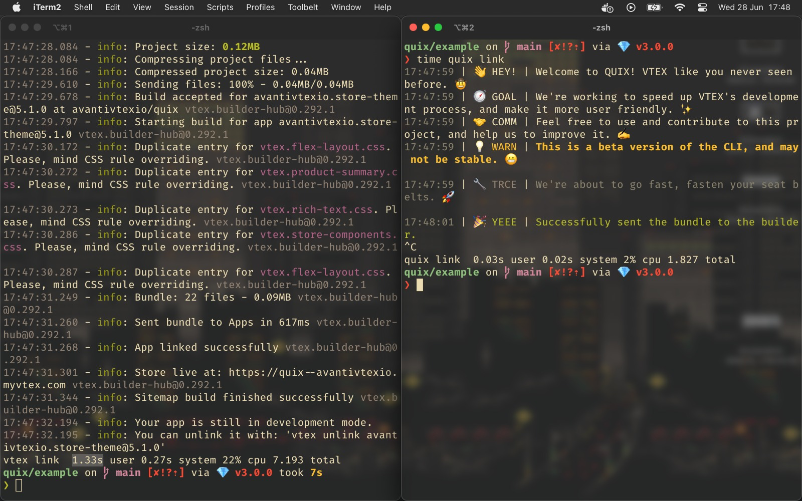

<div align="center">


# Quix

[![Built with rust][rust-badge]][rust] [![License][license-badge]][license]

Quix is a **CLI**, created aiming for **the best developer experience** with the [VTEX IO](https://vtex.io/) platform.

[Getting started](#getting-started) • [Commands](#commands) • [Installation](#installation) • [Contributing](#contributing) • [Known issues](#known-issues) • [LICENSE](#license)

</div>

<a name="getting-started">

# ⚡️ Getting started

</a>

First, to clarify the purpose of this project. As developers, we know the importance of a fast and reliable developer experience. And that's what we are aiming for, to make the VTEX IO developer experience as pleasant as possible.

<a name="commands">

# ⚙️ Commands

</a>

> **Note**: This CLI is a work in progress, and only a few commands are currently available.

The following commands are available:

## ⛓️ Link

> Links the project to the current workspace.

This command will synchronize the local project with the remote VTEX account you are logged in. _(At the moment, the `login` and `use` commands are not implemented, use the [VTEX IO CLI](toolbelt) instead.)_

### Usage

```bash
qx link <FLAGS>
```

#### Flags

| Flag | Description                                   |
| :--: | :-------------------------------------------: |
| `-c` | Cleans the project cache before linking.      |
| `-q` | Enables **quick** linking, skipping steps. 👀 |

<a name="installation">

# 📦 Installation

</a>

1. Check the [releases]("https://github.com/rafaelrcamargo/quix/releases") page to download the latest version of the CLI.

2. Then we need to setup the CLI, for an easier setup we have created a script to add the CLI to your `PATH` environment variable. The setup process goes as follows:

<details>
<summary>🖥️ Windows</summary>

> **Warn**: Tested on version `0.0.0`, newer versions are expected to work, but not covered.

```powershell
git clone https://github.com/rafaelrcamargo/quix
cd quix

cargo run # OR cargo build --release
```

</details>

<details>
<summary>🍎 MacOS</summary>

```bash
git clone https://github.com/rafaelrcamargo/quix
cd quix

cargo run # OR cargo build --release
```

</details>

<details>
<summary>🐧 Linux</summary>

> **Warn**: Tested on version `0.0.0`, newer versions are expected to work, but not covered.

```bash
git clone https://github.com/rafaelrcamargo/quix
cd quix

cargo run # OR cargo build --release
```

</details>

## 🧮 Improvements

One of the main focuses of this project is performance. We have implemented and documented several benchmarks to help improve the performance of Quix. The following benchmark is available:

<details open>

<summary>

### 📈 Benchmarks

</summary>

- [🛑 Minifier](/benchmarks/minifier/results.md)
  - Compares the performance of the minifier crate and the VTEX IO Link endpoint, analyzing the performance of raw files and minified files in the initial and subsequent `quix link` commands.
- ⚖️ Release + Compression
  - With the search for a small and efficient binary, we have implemented a release script that uses the common `cargo` commands to build the binary, and then compress it using the [UPX](https://upx.github.io/) tool with reduced the final binary size by **~40%** (On Mac).

  <br />
  ```sh
        File size        Ratio      Format      Name
  --------------------   ------   -----------   -----------
  1990232 ->    786448   39.52%   macho/arm64   quix
  ```

  - With this we finish with a binary that weights **~750K**, wich is a great improvement from the original **~1.2M**, it's a known fact that the Rust compiler generates binaries with a bigger size, but with this we can reduce the size of the binary to a more reasonable size.

  <br />
  ```sh
  -rwxr-xr-x@ 1 ....  staff   768K ... .. ..:.. ./quix
  ```

</details>

<a name="results">

## 📊 Results

</a>

The following results were obtained using the `time` utils on Mac OS on a MacBook Air M1.

> Time can sound as a weird choice based on the modern standards, but as both of the CLI's keep running in watch mode, the test's were made based on the first sight of the `Linked successfully` message.



<div align="center">
  On the left, the original VTEX CLI, and on the right, the Quix CLI. <i>(Between tests, the cache was cleared and all apps we're unlinked)</i>
</div>

<br />

> **Note**: The results may vary depending on the machine and the project.

<a name="known-issues">

# 🕵️ Known issues

</a>

<details>
<summary>VS Code - Terminal not rendering properly?</summary>
<br>
That's a known issue, and it's related to the way VS Code handles the terminal. To fix this, just open the settings and add the following line:

```json
{
  ...
  "terminal.integrated.gpuAcceleration": "on"
}
```

This will enable the GPU acceleration for the terminal, and it will fix the rendering issue.

> For now this solves the issue, but can get kinda weird with some appearance settings.

</details>

<a name="contributing">

# 🥇 Contributing

</a>

Contributions to this project are welcome! If you have any suggestions or improvements, please open an issue or pull request.

> **Warn**: The `/release` & `/scripts` are now deprecated, and will be removed in the future.

<a name="license">

# ⚠️ License

</a>

This code is licensed under the [Apache 2.0](LICENSE) license.

[rust-badge]: https://img.shields.io/badge/builtwith-rust-B7410E?style=flat-square
[rust]: https://www.rust-lang.org/pt-BR
[license-badge]: https://img.shields.io/github/license/rafaelrcamargo/quix?color=lightgray&style=flat-square
[license]: https://github.com/rafaelrcamargo/quix/blob/main/LICENSE
